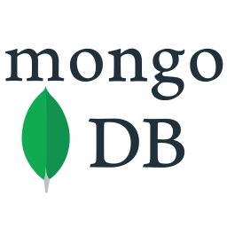

# Discord bot Template


## Technologies

<p style="display:flex; justify-content: center;" align="center">
  
  
  
  
  
  
</div>

## Installation
MacOS Users:

```sh
# install Database
> brew install mongodb-community
# start Database
> brew services start mongodb-community
```

```sh
# install global tools
> sudo yarn global add npx cross-env typescript pm2
# install requiered moduls
> yarn install
```

## use pm2

pm2 allow you to use 100% of your CPU(s)

```sh
> pm2 start ./dist/start.js --name DiscordBot
> pm2 start yarn --name discord_bot
> pm2 restart start -- startdev
> pm2 ls
> pm2 stop INDEX
> pm2 log
> pm2 monit
```

## Contributing

There are many ways in which you can participate in the project, for example:

- Submit bugs and feature requests, and help us verify as they are checked in
- Review source code changes
- Make pull requests for anything from typos to new content

## License

Copyright (c) Kana00. All rights reserved.

Licensed under the MIT license.
